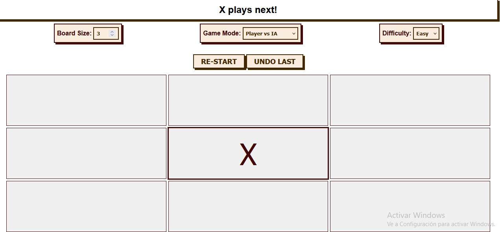

# Tic Tac Toe

It uses standard JavaScript, HTML5 and CSS3 code only so it work in any env. 
And yes, you can play it in your phone. :D

## Main Goal

The classic tic-tac-toe game. The game includes:

- a working 3x3 grid to interact with
- a way to know who's turn is next ("O" or "X")
- a way to know the game result (if there's any winner or if it's a tie)
- a way to restart the game

## Game speficication

The game consists of a 3x3 grid in which each a player (X and O) puts a mark into a blank slot.

The players goal is to connect 3 of their own’s mark in line (row, column or diagonal).

## Valuable Points

- Architecture
- OOP
- Code style
- Useful comments
- Code complexity
- Unit test cases. 
- Markdown.

## Features

- Responsive, clean and neat Interface and interactions

- Accessibility: keyboard interactions, assistive technologies, aria-labels, etc

- Ability to replay the last finished game

- Ability to play against the IA.

- Work with an NxN board

## How to start?

- run `npm install` and go for a coffee or a mate
- run `npm start` and start coding